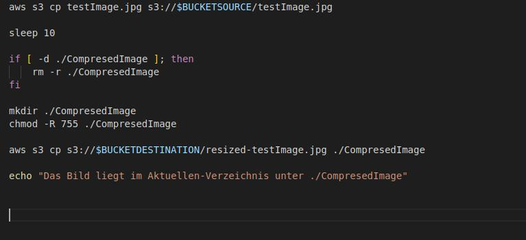

# M346-Bildverkleinerung-AA-LR
Project with AWS
## Anleitung
1. Den Projektordner von Github herunterladen.
2. Die VMWare mit LP22.04 öffnen.
3. Skript in die VMWare übertragen, falls dies nicht bereits geschehen ist.
4. Script über Rechtsklick -> "Run as a Program" ausführen. Optional kann man das Skript auch über das Terminal öffnen.
5. Es verlangt etwas Geduld, da das Laden der Zip-Datei und deren Funktion eine gewisse Zeit in Anspruch nehmen kann. Je nach Internetverbindung geht es schneller oder weniger.
6. Es werden verschiedene Aufrufe an den User gestellt, welche möglichst den Anforderungen getreu umgesetzt werden sollen. Falsche Eingaben führen zur wiederholten Eingabe.
   
## Code Erklärung

Das Indexskript.sh ist dass Hauptskript, welches dann auch ausgeführt werden soll.  Hier wird zuerst geprüft, ob der User AWS CLI installiert hat, um die banalsten Fehler abzufangen. Falls dies nicht der Fall ist wird es automatisch für den User installiert und natürlich geprüft, ob es dann auch wirklich installiert ist. 
In einem nächsten Schritt werden die Konfigurationen geprüft, dass heisst ob die nötigen Berechtigungen/Credentials vorhanden sind, dass man das Skript ausführen kann. Falls nicht wird der User aufgefordert diese zu setzten, bis sie korrekt eingetragen sind. 
Erst dann werden die Buckets erstellt, mit der Abfrage, ob diese nicht unter diesem Namen bereits existent sind, bis hin zu der Abfrage der gewünschten Verkleinerungszahl. Dies wird in Form von Prozent abgefragt. Der User hat keine Möglichkeit auf andere Formate.
Im nächsten Schritt wird im Ordner gesucht, ob die Verbindung zum LambdaSkript existiert und wenn dies der Fall ist wird es ausgeführt. Hierbei beachten, dass für jeden Aufruf alte Ausführungen gelöscht werden.  Am Ende wird dass verkleinerte Bild in den zweiten Bucket übergeben und für den User heruntergeladen.

Das Node_modules Packet befindet sich im Lambda.zip und ist ein Ordner, welches als eine Art Library funktioniert. Es beinhaltet unterschiedliche Installationen von anderen Extensions, welche im Endeffekt im Code genutzt werden, um dessen Funktionalität zu gewährleisten. Unteranderem befindet sich beispielsweise das Sharp-Installationspacket darin. Mit jenem wurde die Lambda-Funktion erstellt, da es Teile beinhaltet, welche die Bildverkleinerung gewährleistet.
Unter anderem befindet sich das LambdaScript.js darin, in welchem dann effektiv das Skript für die Lambda-Funktion erstellt wurde. Heir werden als erstes die Verbindungen zu node_modules eingebaut um deren Nutzbarkeit zu vergewissern. In einem zweiten Schritt wird, da es ein Js File ist ein Event erstellt. Mit diesem kann man von dem AWS CLI Skript aus auf die Lambda-Funktion zugreifen. In einem zweiten Schritt wird zuerst eine S3 Instanz kreiirt und direkt anschliessend das Source Bucket eingeflossen, um an das Bild darin zu kommen. In einem nexten Step wird dann die Prozentzahl dazugenommen. Um Fehler abzufangen wird die Bildverkleinerung in einem Try-Catch-Case abgehandelt.  Dabei wird das Bild genommen und in der Funktion verkleinert, um dann in einem Buffer gespeichert zu werden. Im letzten Schritt wird das Bild über den putObjekt-Aufruf in den zweiten Bucket gespeichert. Dafür sind wieder Bucketname und -key von Nöten. 
Die Package(-...).json files sind für die Verbindungen, auch Dependencies genannt, zwischen node_modules und lambdaScript verantwortlich. 

Unteranderem sind alle Screenshots für die Dokumentation und die Dokumentation im README abgelegt.

## Tests

In diesem Test wird überprüft, ob der Bucket bereits existiert und wenn er bereits existiert eine Fehlermeldung ausgegeben wird. Hier mussten wir einige Male herumprobieren, bis wir realisiert hatten, dass der oberste Aufruf des Bash-Interpreters noch nicht eingefügt war und der Standard-Interpreter den Code nicht öffnen konnte.

In diesem Schritt wurde geprüft, ob die Prozentzahl des Users eingegeben werden kann. Dabei hat es zuerst einen Fehler ausgespuckt, weil die Erstellung des Destinantion-Buckets nicht in der Schleife eingebaut war. Im Nachhinein hat es funktioniert. 

Test ob die Prozentzahl für die Bildverkleinerung übergeben werden konnte. Zuerst haben wurde ein Error zurückgegeben, weil die Erstellung des Destinationbuckets nicht in der Schleife mitgegeben wurde. Im Nachhinein hat es dann aber funktioniert.

Es wurde geprüft, ob die Lambdafunktion richtig erstellt wird und ob die Berechtigungen für den Bucket gesetzt werden. Hier wurde zuerst eine falsche Variable bei der Berechtigung angegeben, weshalb es einige Probleme gab.

Test um die Existenz von AWS CLI, war erfolgreich.

Prüfung, ob Konfiguration im Falle der Nicht-Existenz erstellbar ist. Hier ist aufgrund der nicht möglichen Übergabe des Session Tokens fehlgeschlagen. Jedoch mit einem expliziten Aufruf, dass man einen Input haben möchte, welche den Session Key übergeben, hat es schlussendlich funktioniert.

Es wurde getestet, ob das Bild in den ersten Bucket hochgeladen wurde. Dies hat keine Probleme bereitet. Beim Download wiederum gab es Probleme weild die Funktion noch nicht ganz ausgeführt wurde und das Bild noch nicht im Bucket zwei abgelegt war. Dies wurde durch ein Sleep 10 behoben.

## Reflexion
### Aaron
### Larissa

Im allgemeinen hat die Aufgabenstellung mich etwas überfordert, da wir in den vorherigen Lektionen das Thema etwas zu schnell für meinen Geschmack durchgegangen sind. Dementsprechend war ich sehr froh über die Gruppenzusammenarbeit, da sie mich entlastet hat und ich Aufgaben die ich noch nicht ganz Verknüpfen konnte mit meinem kompetenten Partner abgleichen konnte. Im allgemeinen habe ich mich mit der Lambda-Funktion befasst. Einen Teil konnte ich aus den Aufgabenblätter entnehmen der restliche Grossteil hat mir das Internet geliefert und fürs Verständnis Chat GPT und meine Oberstiften. Zurückblickend finde ich es nicht so gut, dass man den Funktionsinhalt nicht vorab gestellt bekommt, denn im Endeffekt bleibt einem gar nichts anderes übrig als die Informationen, welche man eventuell auch nicht immer gerade versteht, aus dem Internet zu beziehen und es ist im Ende nicht das Ziel, wer besser Research betreibt, sondern die vorherigen Aufgaben anwenden zu können.
Ein weiterer negativer Aspekt aus meiner Seite war unser Zeitmanagement. Im allgemeinen hätte es der Qualität des Projektes geholfen, hätten wir nicht zeitgleich zwei weitere Projekte abschliessen müssen und nicht noch reguläre Prüfungen zu schreiben gehabt. Dementsprechend hat unsere Gruppe klare Prioritäten gesetzt, bei denen die Lektionen im Unterricht nirgendswohin gereicht haben. 
Dennoch fand ich das Projekt lehrreich und hatte einigermassen Spass, dies umzusetzten.

## Quellen

