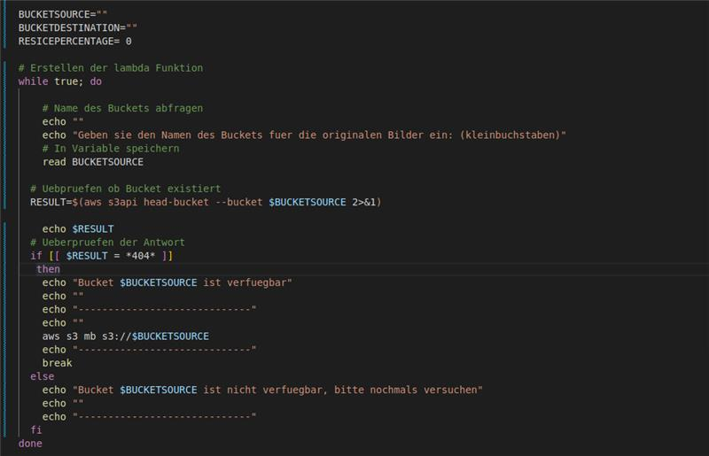

# M346-Bildverkleinerung-AA-LR
Project with AWS
## Anleitung
1. Den Projektordner von Github herunterladen.
2. Die VMWare mit LP22.04 öffnen.
3. Skript in die VMWare übertragen, falls dies nicht bereits geschehen ist.
4. Script über Rechtsklick -> "Run as a Program" ausführen. Optional kann man das Skript auch über das Terminal öffnen.
5. Es verlangt etwas Geduld, da das Laden der Zip-Datei und deren Funktion eine gewisse Zeit in Anspruch nehmen kann. Je nach Internetverbindung geht es schneller oder weniger.
6. Es werden verschiedene Aufrufe an den User gestellt, welche möglichst den Anforderungen getreu umgesetzt werden sollen. Falsche Eingaben führen zum Abbruch des Skripts.
   
## Code Erklärung
## Tests

In diesem Test wird überprüft, ob der Bucket bereits existiert und wenn er bereits existiert eine Fehlermeldung ausgegeben wird. Hier mussten wir einige Male herumprobieren, bis wir realisiert hatten, dass der oberste Aufruf des Bash-Interpreters noch nicht eingefügt war und der Standard-Interpreter den Code nicht öffnen konnte.

In diesem Schritt wurde geprüft, ob die Prozentzahl des Users eingegeben werden kann. Dabei hat es zuerst einen Fehler ausgespuckt, weil die Erstellung des Destinantion-Buckets nicht in der Schleife eingebaut war. Im Nachhinein hat es funktioniert. 

Test ob die Prozentzahl für die Bildverkleinerung übergeben werden konnte. Zuerst haben wurde ein Error zurückgegeben, weil die Erstellung des Destinationbuckets nicht in der Schleife mitgegeben wurde. Im Nachhinein hat es dann aber funktioniert.

Es wurde geprüft, ob die Lambdafunktion richtig erstellt wird und ob die Berechtigungen für den Bucket gesetzt werden. Hier wurde zuerst eine falsche Variable bei der Berechtigung angegeben, weshalb es einige Probleme gab.

Test um die Existenz von AWS CLI, war erfolgreich.

Prüfung, ob Konfiguration im Falle der Nicht-Existenz erstellbar ist. Hier ist aufgrund der nicht möglichen Übergabe des Session Tokens fehlgeschlagen. Jedoch mit einem expliziten Aufruf, dass man einen Input haben möchte, welche den Session Key übergeben, hat es schlussendlich funktioniert
